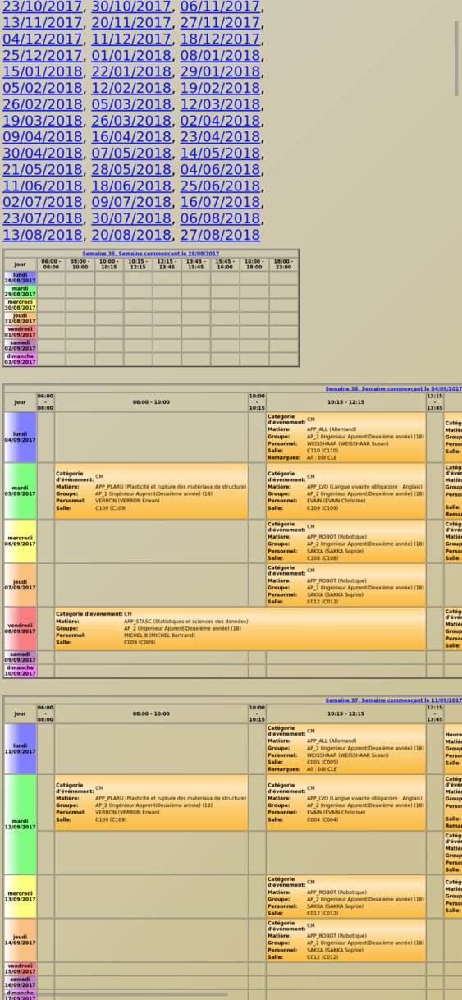
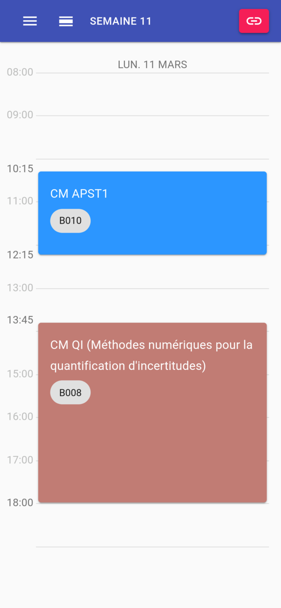

  
#### Background

Our school uses a software called Celcat to manage and plan courses. While it seems rather reliable, it looks _really bad_ and is barely usable on mobile. Fortunately, calendars are exposed as (styled) XML files, which makes it easy to parse them.

This is exactly what this app does: an Express app fetches the XML, parses and caches the result. The React app does the rest!

#### Challenges

This is not a very complicated project, however it proved useful as a playground to test things such as server-side rendering and progressive web apps.

#### Features
  
* calendar API + React app
* server caching
* **calendar customization**: specific subjects (optional courses for instance) can be hidden
* offline access using local storage and **server-side rendering**
* **mobile friendly**: fully responsive, can be installed as a PWA